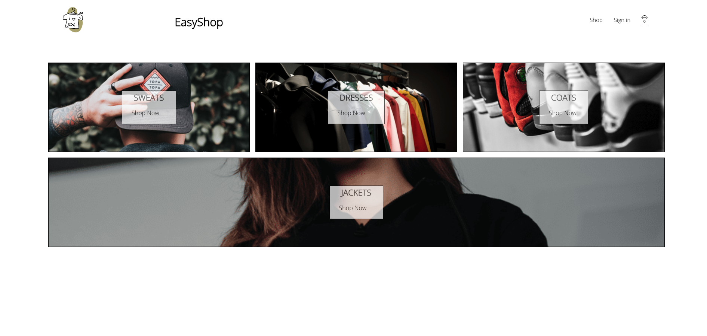
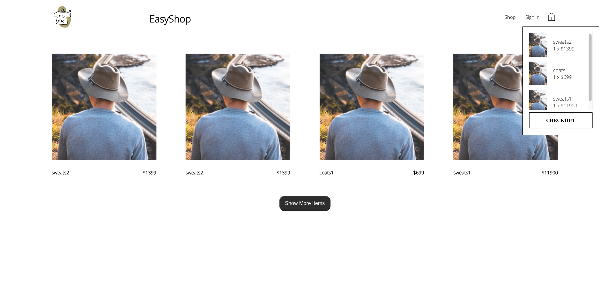
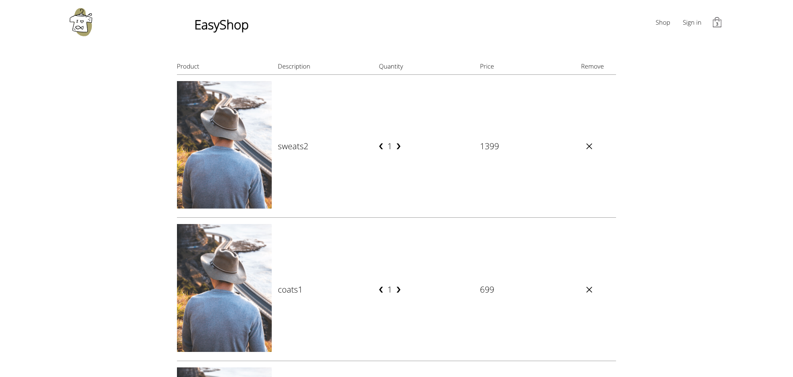
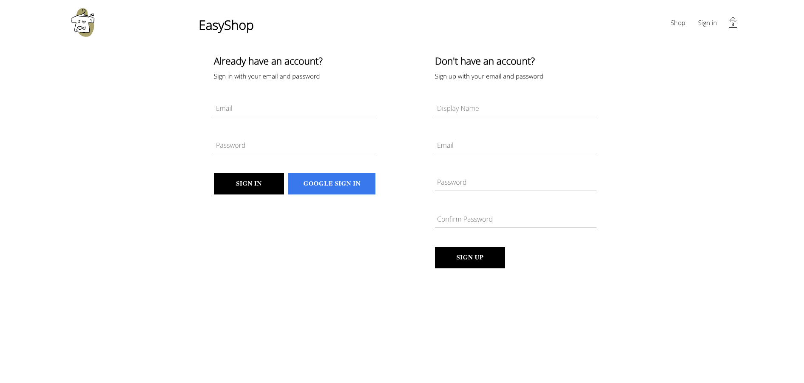

# EasyShop - A React-Based E-Commerce Project

## Introduction:

EasyShop is a dynamic e-commerce project developed using React, designed to provide users with a seamless online shopping experience. This project encompasses essential features such as product categorization, product display, shopping cart functionality, user registration, and Google Account sign-in, making it a comprehensive solution for modern online retail.

## Key Features:

- Product Categories and Display

​    EasyShop offers a well-organized system of product categories, allowing users to easily navigate and explore a wide range of items. The intuitive user interface ensures a smooth browsing experience, helping customers find what they are looking for effortlessly.

- Shopping Cart

​    The shopping cart functionality is a core component of EasyShop, providing users with a convenient way to add, remove, and manage their selected items. The real-time updates and interactive features ensure a user-friendly and efficient shopping process.

- User Registration

​    EasyShop incorporates a user registration system, allowing customers to create personalized accounts. This feature not only streamlines the checkout process but also enables users to track their order history and save preferences for a more personalized shopping experience.

- Google Account Sign-In

To enhance user convenience and security, EasyShop integrates Google Account sign-in functionality. Users can effortlessly log in using their Google credentials, minimizing the need for additional account creation and ensuring a secure authentication process.

- Responsive Design

EasyShop is built with a responsive design, ensuring a consistent and visually appealing experience across various devices, including desktops, tablets, and smartphones. This adaptability contributes to a seamless user experience regardless of the platform.

## Available Scripts

In the project directory, you can run:

### `npm start`

Runs the app in the development mode.\
Open [http://localhost:3000](http://localhost:3000) to view it in your browser.

The page will reload when you make changes.\
You may also see any lint errors in the console.

### `npm run build`

Builds the app for production to the `build` folder.\
It correctly bundles React in production mode and optimizes the build for the best performance.

The build is minified and the filenames include the hashes.\
Your app is ready to be deployed!

See the section about [deployment](https://facebook.github.io/create-react-app/docs/deployment) for more information.

